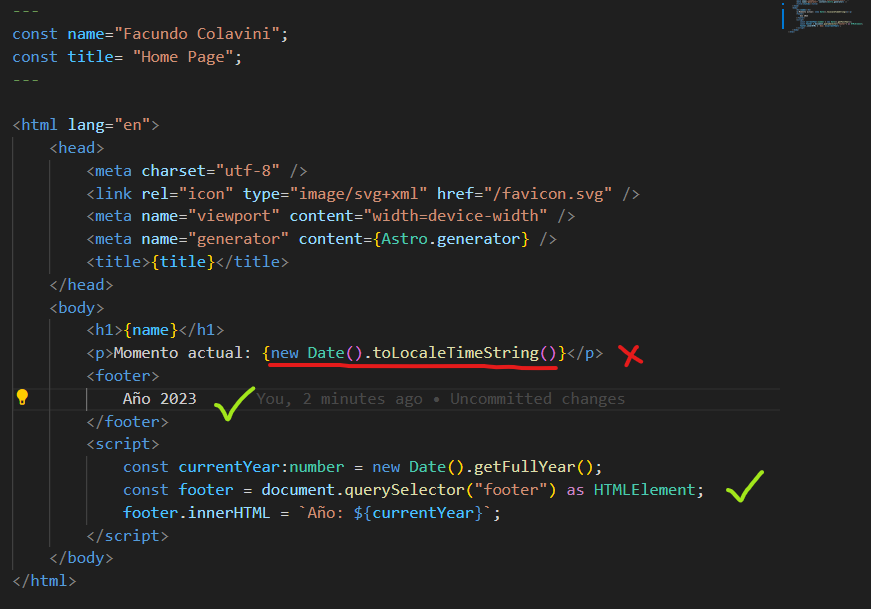
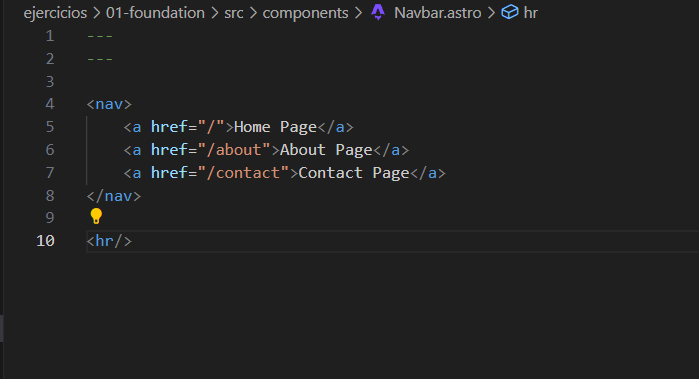
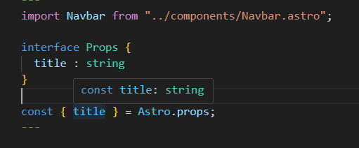
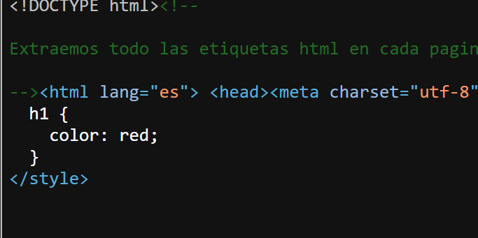
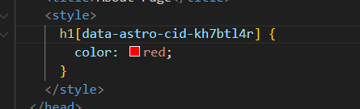
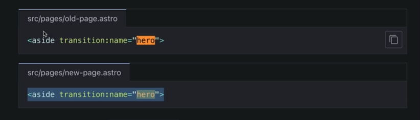

# Bases de Astro

Vamos a ver una instroduccion creando sitio estaticos y ver comportamientos que tiene astro.

Astro incrustra todo nuestro codigo en un index.html.

Puntualmente veremos:

- Sintaxis
- Componentes de astro
- Layouts
- Estilos
- Navegación entre pantallas
- Estructura
- Props
- Página 404
- Introducción View Transitions
- Sitio a producción estático
- Despliegue a la web

## Que es astro

Astro es un framwork para crear a sitios orientado a contenido.
Si necesitamos un sitio del tipo SEO frendly astro es una excelente opcion.
Astro nos permite utilizar algo que le llama islas donde nos permite la integración de otros frameworks dentro de astro como Vue,Preact,React y Solid.

El build de astro de nuestro proyecto lo unico que genera es nuestro index.html y iconos o imagenes.

Muchas veces necesitamos un sitio liviano y sin tantas herramientas integradas en el framework que optemos. Por eso astro no manda javascript al navegador del cliente y es tan liviano

Algunas de las ventajas que nos da astro

- Rendimiento Optimizado
- Experiencia al desarrollador
- SEO friendly
- ECMAScript mmoderno y TypeScript
- Extensibilidad y personalizacion
- Crece acorde a la necesidad
- Static Site Generation
- Server Side Rendering
- Hybrid
- Multi-Page Applications
- Server Actions (Ejecutar funciones del lado servidor llamandolas en el lado cliente)
- Astro DB
- View Transition
- Pre-fetch
- Vite
- Middlewares

Algunas desventajas que tiene Astro :

- SPA (Single Page applications): Noes su enfoque para esto es mejor usar los frameworks tradicionales.

- La comunidad va creciendo pero no es tan grande aun.
- La interactividad es un trabajo manual que depende de Vnilla Javascript/TypeScript o UI Framework (Islas).
- Integrar frameworks o librerias de UI requiere tener las bases de esas tecnologias.

## App de la seccion

- 01-foundation

## Code Fence (Frontmatter)

Lo que coloquemos dentro del Code Fence sera server only , solo se ejecutara del lado servidor. Si el sitio es estatico todo lo que este dentro se ejecutara en el momento de construccion de la aplicacion.

```javascript
---
const name = 'Facundo Colavini';
const title = 'Home Page';
---
```

Al ejecutar el build de nuestra pagina astro por defecto genera todo de forma estatica. Esto quiere decir que no hay interacciones del lado del servidor.
El build generara una carpeta dist donde contiene nuestros archivos estaticos  html y svg.No hay nada de javascript generado y podemos subirla a cualquier hosting lo unico que se necesita es algun servicio que sirva archivos html y svg.

**Importante:**
Saber que cuando se esta queriendo ejecutar javascript del lado servidor en nuestro componente de astro en estatico no se podra hidratar el contenido y salvo si es javascript que enviamos al cliente utilizando script.



## Routes pages

Podemos crear nuestras paginas dentro de la carpeta `pages` donde cada archivo .astro creara una ruta nueva en nuestra aplicacion.

Si la pagina no esta creada dentro de `pages` va a redirigir a la pagina 404.astro automaticamente.

## Componentes de Astro

Podemos reutilizar nuestras piezas de UI creando nuevos archivos .astro dentro de la carpeta `components`.
Se recomienda nombrar los componentes de astro con capitalización `Navbar.astro`.
Astro no necesita de los fragmentos para regresar mas de un root element.



Al momento de construir nuestra aplicacione los componentes  donde se utilicen se construyen y se vuelven parte del html con el resto del index.html de la pagina donde se utiliza.

## Layouts y Props

Para nuestros Layouts es buena practica tener una carpeta llamada `layouts` dentro de nuestro `src/layout`

**Layouts:** Son componentes reutilizables de astro que envuelve nuestra aplicaciones en tags como `<html>`, `<head>` y `<body>`.
**Slots:** Los slots sirven para inyectar contenido del padre.

**Props**: Las props sirven para pasar información a nuestros componentes para utilizarlas utilizamos Astro.props para destrucutrarlas.
Para activar el tipado estricto de nuestras props y especificar un tipado lo hacemos creando una interface llamada Props y astro infiere los tipos basados en las props.



## Estilos por componente y globales

Para poder dar estilos a nuestra aplicacion dentro de los archivos .astro nos permite escribir css nativo dentro de las etiquetas `<style>`.

La idea es que los estilos puedan ser tanto reutilizables como personalizado para una pagina en particulas o componente para esto utilizamos las directivas `is:global`.

**sin-directivas**: El css se encuentra procesado por astro y lo coloca exactamente en el head donde astro hace un hash para no pisar estilos con otras etiquetas.

**is:global**: Para salir de nuestro scoping de nuestro css.No se encapsula a ese componente.

Si queremos colocar los estilos globales en una carpeta determinada como en `src/styles/global.css` donde se guardan los estilos globales de la app.

**is:inline**: Nos deja la tiqueta style asi como esta en nuestra pagina template.Y no hay ningun tipo de procesamiento.


**is:raw**: Le decimos al compilador de astro que trate como un tipo de texto y no haga procesamientos.

Cuando cambiamos nuestras directivas una por otra para ver cambios es conveniente reiniciar el servidor de desarrollo.

Para definir estilos compartidos se utiliza `<style is:global></style>` donde podemos compartir nuestros estilos en toda nuestra aplicación

**Public**
Cuando queremos que astro procese algo lo colocamos en nuestra carpeta publica como las fuentes.
De esta forma astro procesa los estilos fuentes,etc.

## View Transition

Nos permite hacer parecer a nuestra app a un SPA.View transition agrega algunas transitiones a nuestra aplicación.Y al agregar el view transition activa la funcionalidad de prefetch donde precarga los enlaces y los recursos.

**Naming a transition**
Podemos agregar nombres a nuestras transitiones entre paginas con la directiva:
`transition:name`: esto nos permite dar una animacion a un elemento que se comparte entre otro.


