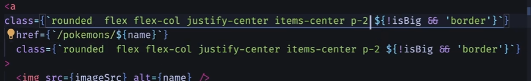

# Sitios estaticos generados de forma dinamica -  SSG (Static Site Generation)

Es cuando tenemos un numero finito de productos o pokemons y esa informacion no cambia tan frencuentemente , astro se encarga de crear esas paginas antes de solicitarlas y de manera que no necesitemos crear ese contenido del lado del servidor.

Tambien podemos generar paginacion de manera estatica, en astro esto lo logramos con 0 codigo de javascript

## Temas puntuales

Esta es una sección muy interesante porque aprenderemos a crear páginas por adelantado para nuestro sitio web estático, esto incluye funcionalidades como:

- Animaciones entre pantallas
- Generación de 151 páginas en tiempo de construcción
- Lectura de argumentos dinámicos por URL
- Name Transitions
- Estilo condicional
- Path alias de TypeScript
- Interfaces y tipado
- Metatags básicas para SEO (title, description e image)
- Pruebas a la hora de compartir los enlaces por redes sociales

## Integraciones

Una integracion nos va a permitir usar diferentes frameworks o librerias o adaptadores para la generacion del lado del servidor.

- Para integrar tailwind `npx astro add tailwind`
Tailwind al utilizarlo en el modo de desarrollo podremos ocupar todas las funcionalidades y sintaxis. En modo produccion tailwind hace un archivo css estandar con las clases que utilizamos en nuestro proyecto.Tailwind ajusta el css acorde a lo que estamos utilizando.

- En desarrollo:


- Achivo en dist


## Peticiones HTTP

**Importante**: Si nosotros nmo tenemos ninguna integracion que nos permita el server side, a pesar que miremos los mensajes por la consola del servidor no se veran. Solo se veran en tiempo de construccion.
Asi que las integraciones son solamente en el momento de construccion.


Utilizamos la API para hacer un fetch a la API de pokémons.No hace falta hacer una funciona para envolver al fetch ya que es un hilo asincrono todo lo que se ejecuta en el frontmatter de un componente de astro.

Si la pagina es estatica no vamos a tener javascript en nuestra aplicacion solo servira la pagina estatica con el listado de pokémons.

A la hora de recorrer y devolver el listado de los pokémons no es necesario ocupar el key por que esos elementos no cambian de posicion.Ya que el contenido es estatico y no se mueven los elementos.


## Páginas Dinámicas

Para crear una pagina dinámica debemos poner entre llaves el argumento que vamos a esperar por ejemplo:

En este caso vamos a ir a una ruta dinámica que espera el argumento name


Al hacer estoy y redirigirmos a la pagina dinamica de ese pokemon nos va a dar este error:


Este error surge por que de antemano le tenemos que decir a astro que nos genere todas las páginas permitidas y cualquier pagina que no este definida va a enviar un 404.

**getStaticPaths**: Es una funcion requerida para rutas dinámicas si estamos realizando contenido estatico.

```typescript
---
export async function getStaticPaths() {
  return [
    { params: {  name: 'bulnasaur'} },
    { params: {  name: 'charmander'} },
    { params: {  name: 'raticate'} },
   
    // ...Otros paths
  ];
}
---
```

Lo que debemos hacer es en el arreglo es regresar todo el listado de paths posibles.
Esto va a hacer que pueda tomar ese paths y devolvernos la pagina correspondiente `http://localhost:4321/pokemons/raticate`.

**Importante**: Si trabajamos con server side osea con `output:server` o `output:hibryd` no hace falta la funcion getStaticPaths.

**Astro Params**
Para capturar los parametros de mi name utilizamos Astro.params.Esto quiere decir que podemos tomar los valores de la url en este caso el nombre del pokémon.

```javascript
// Capturamos el nombre de la url de mi pokémon 
const {name} = Astro.params

```

Cuando hagamos el build de producción astro va a transformar nuestras rutas dinámincas para generararlas de forma estatica.

## Props dinámicas

Si necesitamos mostrar mas cosas.Y recibir mas información en nuestra pagina estatica debemos utilizar las props de forma dinámica en nuestra funcion getStaticPaths.Las properties que vamos a ocupar enviar a nuestro componentes.


Properties ahora podemos usar la proppertie url que le enviamos a nuestra page [name].astro.


Para entenderlo mejor debemos imaginar que la pagina dinamica como una pagina normal que recibe props y puede recibir params pero de forma iterativa.

Cuando hagamos el build de producción solo creara esas 2 paginas cualquier otra pagina arrojara un 404.

## Crear todas las paginas - Static site generation

Las paginas se van a crear antes que las pida el usuario.En este caso vamos a generar 151 paginas.
Par eso hacemos que nuestra funcion `getStaticPaths` sea asincrona para obtener los datos de los 151 pokemones y luego iteramos dando la estructura correcta en el return.Debe respetarse los params y props.


En produccion quedaria asi


Todas las paginas generadas estaticamente


## Estilos condicionales

Para crear estilos de forma condicional hay varias formas.
**ternario**: Podemos agregar o no un valor de class mediante un ternario.Pero esto produce que se cree un valor en la class llamado false pudiendo generar o no algun conflicto futuro.



**class:list**:Nos permite enviar una lista de classes entonces lo que vamos a hacer es enviar como primer valor agregamos los estilos default de mis y luego las validaciones o variantes que necesitos de mis estilos.


Al hacer la compilacion por mas logica que tengamos en nuestro archivo de astro va a terminar siendo un archivo html.

## ViewTransitions

Las viewtransitions tendremos un fade in al hacer la transision y un prefetch.Ademas de transisiones entre paginas que tenga una elemento similar.

## Paginación Estatica

La paginacion debe utilizar el getStaticPaths por lo que esto quiere decir que debe tener una Paginas dinamicas como `[page].astro` o `[...page].astro` para poder destructurar del getStaticPaths el `{paginate}` y esto nos regresa un objeto pages con la informacion de la pagina, si tiene siguiente que pagina esta,etc.


**[name].astro**: Solo atrapamos una pagina en particular.
**[...name].astro**: Atrapamos todos los paths que pasen por ese ...page.

[**astro-paginacion**](https://docs.astro.build/en/reference/api-reference/#paginate)

## Paths Alias

